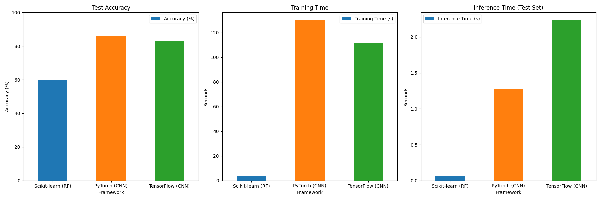

# DL Framework Comparison

This project aims to compare the most common Deep Learning Frameworks (TensorFlow and PyTorch) using the Intel Image Classification Dataset.

## Prerequisites

### 1. Install `uv`

This project uses `uv` as the dependency manager. You can install it following the instructions in the [uv documentation](https://docs.astral.sh/uv/getting-started/installation/).

The most common way to install `uv` is via curl:

```bash
curl -LsSf https://astral.sh/uv/install.sh | sh
```

### 2. Download the Dataset
Download the [Intel Image Classification Dataset](https://www.kaggle.com/datasets/puneet6060/intel-image-classification) from Kaggle. Extract the downloaded archive and place the contents into a directory named `data` at the root of this project. 

## Project Structure

The repository is organized as follows:

```text
dl-framework-comparison/
├── assets/
│   └── benchmark.png
├── data/
│   ├── seg_train/
│   ├── seg_test/
│   └── seg_pred/
├── src/
│   ├── baseline/
│   │   └── baseline_model.py
│   ├── benchmark/
│   │   └── run_benchmarks.py
│   ├── preprocessing/
│   │   └── data_loader.py
│   ├── pytorch/
│   │   ├── dataset.py
│   │   ├── model.py
│   │   └── train.py
│   └── tensorflow/
│       ├── dataset.py
│       ├── model.py
│       └── train.py
├── pyproject.toml
└── README.md
```

## Usage Guide

### Installation

Install the project dependencies and the local `src` package in editable mode using `uv`:

```bash
uv pip install -e .
```

### Running the Models

You can execute the training scripts for each framework individually:

- **Scikit-learn Baseline:**
  ```bash
  uv run python src/baseline/baseline_model.py
  ```
- **PyTorch CNN:**
  ```bash
  uv run python src/pytorch/train.py
  ```
- **TensorFlow CNN:**
  ```bash
  uv run python src/tensorflow/train.py
  ```

### Running the Benchmarks

To run all models sequentially and generate the comparison metrics and plots:

```bash
uv run python src/benchmark/run_benchmarks.py
```

## Evaluation

The evaluation compares three different approaches to the image classification task:

1. **Scikit-learn (RF):** A baseline Random Forest classifier trained on flattened 64x64 pixel representations of the images.
2. **PyTorch (CNN):** A custom Convolutional Neural Network architecture trained for 10 epochs using the Adam optimizer and CrossEntropyLoss.
3. **TensorFlow (CNN):** An equivalent CNN architecture built with the Keras Sequential API, trained for 10 epochs using the Adam optimizer and SparseCategoricalCrossentropy.

### Benchmark Results

The following log shows the final benchmark results comparing total script execution time, training time, inference time on the test set, and overall accuracy.

```text
==================================================
FINAL BENCHMARK RESULTS
==================================================
        Framework  Total Script Time (s)  Training Time (s)  Inference Time (s)  Accuracy (%)
Scikit-learn (RF)                   9.91               3.58                0.06         60.07
    PyTorch (CNN)                 133.75             129.91                1.28         85.90
 TensorFlow (CNN)                 116.88             111.94                2.23         82.93
```



The baseline model provides a fast but low-accuracy starting point. Both deep learning frameworks significantly outperform the baseline in accuracy. In this specific run, TensorFlow demonstrated a slightly faster training time, while PyTorch achieved a higher accuracy and faster inference time.

## Notes

- This project is intended for educational purposes and can help getting familiar with DL frameworks like TensorFlow and PyTorch.
- While I invested a lot of time in designing the basic project structure, the code itself is currently mainly written with the help of AI tools. I plan to refactor and optimize the code in the future as the current form is not up to my code quality standards.
